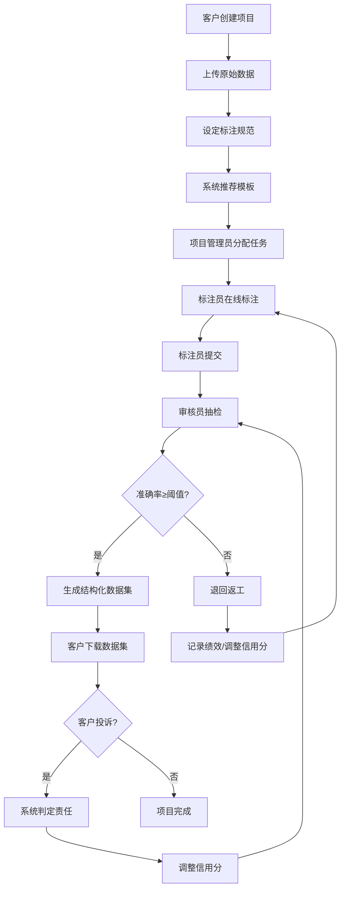

## 1. 产品概述

大型数据标注平台是一款面向AI训练数据生产的专业SaaS平台，支持标注员、审核员、项目管理员和客户四种角色协同工作，实现从数据上传、任务分配、标注执行、质量审核到结构化数据集交付的全流程自动化管理。平台通过智能任务调度、实时质量监控和信用体系，确保标注数据的高质量与高效率交付。

## 2. 核心功能

### 2.1 用户角色

| 角色 | 注册方式 | 核心权限 |
|------|----------|----------|
| 客户 | 邮箱/手机号注册 | 创建项目、上传数据、设定标注规范、下载数据集、投诉质量、查看报表 |
| 项目管理员 | 管理员邀请/指派 | 分配任务、监控进度、管理标注员、查看运营报表、处理异常 |
| 标注员 | 邮箱/手机号注册 | 接收任务、在线标注、提交成果、查看个人绩效 |
| 审核员 | 管理员邀请/指派 | 抽检标注结果、判定合格/退回、审核意见反馈 |

### 2.2 功能模块

1. **登录注册页**: 角色选择、账号注册、登录认证、忘记密码
2. **客户工作台**: 项目创建向导、数据上传、规范设定、模板推荐、数据集下载、投诉管理
3. **项目管理中心**: 任务智能分配、进度看板、标注员管理、质量预警、运营报表
4. **标注工作台**: 任务列表、在线标注工具（文本/图像/音频/视频）、提交与返工
5. **审核工作台**: 抽检任务队列、审核判定、准确率计算、退回返工
6. **消息通知中心**: 任务分配通知、提交审核提醒、质量预警、投诉处理通知、月度报表推送
7. **数据看板**: 标注量统计、准确率趋势、交付时效、信用评分

### 2.3 页面详情

| 页面名称 | 模块名称 | 功能描述 |
|----------|----------|----------|
| 登录注册页 | 角色选择 | 支持4种角色注册，根据角色跳转对应工作台 |
| 登录注册页 | 登录表单 | 邮箱/密码登录，记住登录状态 |
| 客户工作台 | 项目创建向导 | 分步创建项目：基本信息→数据上传→规范设定→模板选择 |
| 客户工作台 | 数据上传 | 拖拽上传原始数据，支持批量导入，显示上传进度 |
| 客户工作台 | 标注规范设定 | 富文本编辑标注要求、示例展示、验收标准 |
| 客户工作台 | 模板推荐 | 系统根据数据类型（文本/图像/音频/视频）自动推荐标注模板 |
| 客户工作台 | 数据集下载 | 已完成项目结构化数据集下载，支持JSON/CSV/XML格式 |
| 客户工作台 | 质量投诉 | 对标注质量发起投诉，填写投诉原因，查看处理进度 |
| 项目管理中心 | 任务智能分配 | 根据标注员技能标签、当前任务量、历史准确率智能分配 |
| 项目管理中心 | 进度看板 | 看板视图展示各任务状态（待分配/进行中/待审核/已完成） |
| 项目管理中心 | 标注员管理 | 标注员列表、技能标签管理、绩效排名、信用分查看 |
| 项目管理中心 | 质量预警 | 低于阈值的准确率实时预警，退回率统计 |
| 项目管理中心 | 运营报表 | 月度标注量、准确率趋势、交付时效，每月1号自动生成 |
| 标注工作台 | 任务列表 | 按优先级/截止日期排列的待办任务，筛选与搜索 |
| 标注工作台 | 在线标注工具 | 文本分类/实体标注、图像框选/分割、音频转录、视频标注 |
| 标注工作台 | 提交与返工 | 提交标注成果，查看退回原因，重新标注 |
| 审核工作台 | 抽检任务队列 | 待审核任务列表，按紧急程度排序 |
| 审核工作台 | 审核判定 | 逐条查看标注结果，判定通过/退回，填写审核意见 |
| 审核工作台 | 准确率计算 | 自动计算标注准确率，低于阈值标记预警 |
| 消息通知中心 | 实时通知 | 任务分配、提交审核、质量预警、投诉处理等实时推送 |
| 数据看板 | 统计图表 | 标注量柱状图、准确率折线图、交付时效雷达图、信用分分布 |

## 3. 核心流程

### 3.1 标注项目全流程

客户创建项目并上传数据 → 系统推荐标注模板 → 项目管理员分配任务 → 标注员在线标注 → 标注员提交 → 审核员抽检 → 准确率计算 → 通过则生成数据集 / 不通过则退回返工 → 客户下载数据集

### 3.2 质量投诉流程

客户发起投诉 → 系统调取标注/审核记录 → 判定责任方（标注员/审核员） → 调整责任方信用分 → 通知责任方 → 必要时安排返工

### 3.3 月度报表流程

每月1号系统自动统计 → 汇总各项目标注量/准确率/交付时效 → 生成运营报表 → 推送到管理员手机端

## 4. 用户界面设计

### 4.1 设计风格

- **主色调**: 深邃蓝 (#0A1628) 搭配活力橙 (#FF6B35) 点缀，专业且富有科技感
- **辅助色**: 冷灰 (#1E293B)、成功绿 (#10B981)、警告黄 (#F59E0B)、错误红 (#EF4444)
- **按钮风格**: 圆角8px，主按钮渐变填充，次按钮描边风格
- **字体**: 标题使用 DM Sans (Bold)，正文使用 Noto Sans SC (Regular)
- **布局风格**: 侧边栏导航 + 顶部操作栏，内容区卡片式布局
- **图标风格**: 线性图标 (Phosphor Icons)，2px线宽，统一风格

### 4.2 页面设计概览

| 页面名称 | 模块名称 | UI元素 |
|----------|----------|--------|
| 登录注册页 | 整体 | 深色渐变背景，左侧品牌展示区(粒子动效)，右侧登录表单卡片(毛玻璃效果) |
| 客户工作台 | 项目创建向导 | 步骤条导航，分步表单卡片，数据类型图标选择，拖拽上传区域 |
| 客户工作台 | 数据上传 | 拖拽上传区(虚线边框)，文件列表(进度条)，批量操作工具栏 |
| 客户工作台 | 模板推荐 | 卡片网格展示推荐模板，数据类型标签，模板预览弹窗 |
| 客户工作台 | 数据集下载 | 数据集列表(状态标签)，格式选择下拉，下载按钮 |
| 项目管理中心 | 任务分配 | 标注员头像卡片(技能标签+当前任务量)，拖拽分配交互 |
| 项目管理中心 | 进度看板 | 四列看板(待分配/进行中/待审核/已完成)，任务卡片拖拽 |
| 项目管理中心 | 运营报表 | 图表区域(ECharts)，日期范围选择器，导出按钮 |
| 标注工作台 | 在线标注 | 左侧数据面板，中间标注画布/编辑区，右侧属性面板 |
| 审核工作台 | 审核判定 | 左右对比布局(原始数据vs标注结果)，通过/退回操作栏 |
| 消息通知中心 | 通知列表 | 左侧分类标签，右侧通知卡片(时间戳+已读状态) |
| 数据看板 | 统计图表 | 大屏风格布局，关键指标卡片+图表组合 |

### 4.3 响应式设计

- 桌面端优先 (1440px+)，完整功能展示
- 平板端 (768px-1024px)，侧边栏折叠为抽屉，卡片单列排列
- 移动端 (<768px)，底部标签导航，简化操作流程

### 4.4 动效设计

- 页面切换：淡入淡出 (200ms)
- 卡片悬停：微微上浮 + 阴影增强
- 看板拖拽：弹性动画反馈
- 数据加载：骨架屏 + 渐入动画
- 通知到达：右上角滑入提示
- 图表渲染：数据逐步绘入动画
