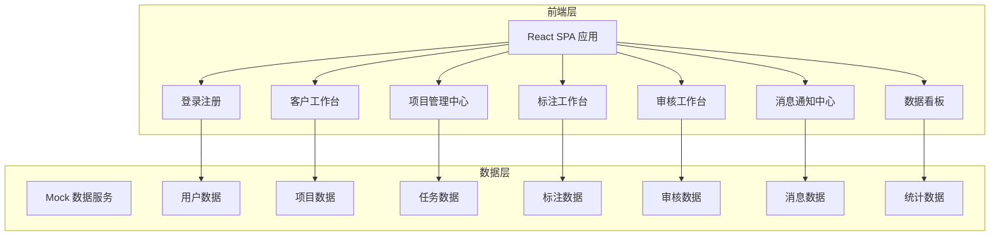
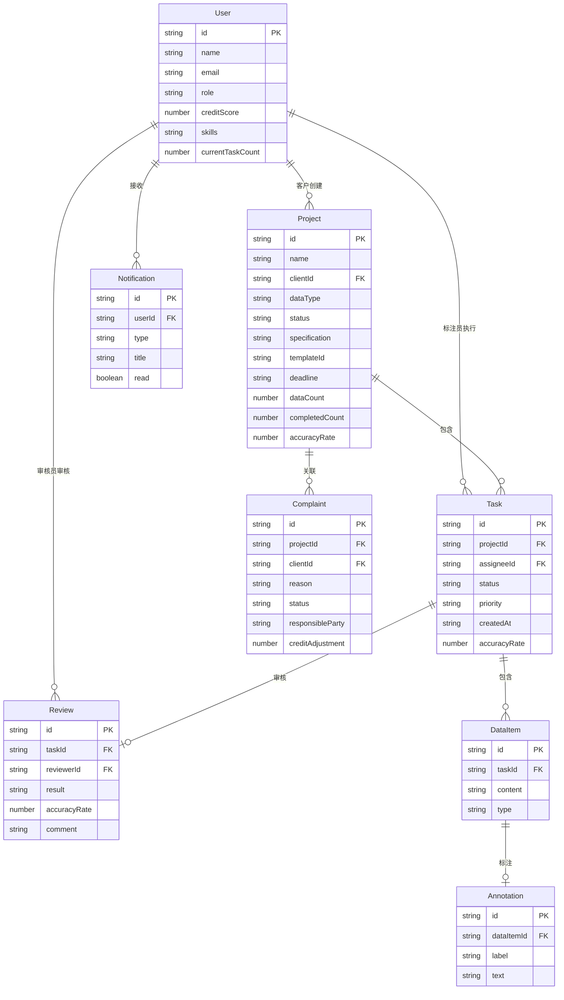

## 1. 架构设计



## 2. 技术说明

- **前端框架**: React@18 + TypeScript
- **样式方案**: Tailwind CSS@3 + CSS Modules (复杂组件)
- **构建工具**: Vite
- **路由管理**: React Router v6
- **状态管理**: Zustand
- **图表库**: ECharts (via echarts-for-react)
- **图标库**: Phosphor React
- **动画库**: Framer Motion
- **HTTP客户端**: Axios (用于模拟请求)
- **后端**: 无后端，使用 Mock 数据模拟全流程
- **数据库**: 无数据库，使用内存状态 + Mock JSON 数据

## 3. 路由定义

| 路由 | 用途 | 权限 |
|------|------|------|
| `/login` | 登录注册页 | 公开 |
| `/client` | 客户工作台首页 | 客户 |
| `/client/project/create` | 创建标注项目 | 客户 |
| `/client/project/:id` | 项目详情/数据集下载 | 客户 |
| `/client/complaints` | 投诉管理 | 客户 |
| `/manager` | 项目管理中心首页 | 项目管理员 |
| `/manager/tasks` | 任务分配管理 | 项目管理员 |
| `/manager/members` | 标注员管理 | 项目管理员 |
| `/manager/reports` | 运营报表 | 项目管理员 |
| `/annotator` | 标注工作台首页 | 标注员 |
| `/annotator/task/:id` | 在线标注 | 标注员 |
| `/reviewer` | 审核工作台首页 | 审核员 |
| `/reviewer/task/:id` | 审核判定 | 审核员 |
| `/dashboard` | 数据看板 | 全部角色 |
| `/notifications` | 消息通知中心 | 全部角色 |

## 4. API 定义

### 4.1 用户相关

```typescript
interface User {
  id: string;
  name: string;
  email: string;
  role: "client" | "manager" | "annotator" | "reviewer";
  avatar: string;
  creditScore: number;
  skills?: string[];
  currentTaskCount?: number;
}

interface LoginRequest {
  email: string;
  password: string;
}

interface LoginResponse {
  token: string;
  user: User;
}
```

### 4.2 项目相关

```typescript
interface Project {
  id: string;
  name: string;
  description: string;
  clientId: string;
  dataType: "text" | "image" | "audio" | "video";
  status: "draft" | "active" | "reviewing" | "completed";
  specification: string;
  templateId: string;
  createdAt: string;
  deadline: string;
  dataCount: number;
  completedCount: number;
  accuracyRate: number;
}

interface CreateProjectRequest {
  name: string;
  description: string;
  dataType: "text" | "image" | "audio" | "video";
  specification: string;
  templateId: string;
  deadline: string;
}
```

### 4.3 任务相关

```typescript
interface Task {
  id: string;
  projectId: string;
  assigneeId: string;
  status: "pending" | "in_progress" | "submitted" | "reviewing" | "approved" | "rejected";
  priority: "low" | "medium" | "high";
  dataItems: DataItem[];
  createdAt: string;
  submittedAt?: string;
  accuracyRate?: number;
  rejectReason?: string;
}

interface DataItem {
  id: string;
  content: string;
  type: "text" | "image" | "audio" | "video";
  annotation?: Annotation;
}

interface Annotation {
  label: string;
  regions?: Region[];
  text?: string;
  timestamp?: number;
}

interface Region {
  x: number;
  y: number;
  width: number;
  height: number;
  label: string;
}
```

### 4.4 审核相关

```typescript
interface Review {
  id: string;
  taskId: string;
  reviewerId: string;
  result: "approved" | "rejected";
  accuracyRate: number;
  comment?: string;
  reviewedAt: string;
}
```

### 4.5 消息通知

```typescript
interface Notification {
  id: string;
  userId: string;
  type: "task_assigned" | "task_submitted" | "quality_alert" | "complaint" | "report_ready";
  title: string;
  content: string;
  read: boolean;
  createdAt: string;
}
```

### 4.6 投诉相关

```typescript
interface Complaint {
  id: string;
  projectId: string;
  clientId: string;
  reason: string;
  status: "pending" | "processing" | "resolved";
  responsibleParty?: string;
  creditAdjustment?: number;
  createdAt: string;
  resolvedAt?: string;
}
```

## 5. 数据模型

### 5.1 数据模型定义



### 5.2 数据定义语言

```sql
CREATE TABLE users (
    id VARCHAR(36) PRIMARY KEY,
    name VARCHAR(100) NOT NULL,
    email VARCHAR(100) UNIQUE NOT NULL,
    password VARCHAR(255) NOT NULL,
    role ENUM('client', 'manager', 'annotator', 'reviewer') NOT NULL,
    avatar VARCHAR(255),
    credit_score INT DEFAULT 100,
    skills JSON,
    current_task_count INT DEFAULT 0,
    created_at TIMESTAMP DEFAULT CURRENT_TIMESTAMP
);

CREATE TABLE projects (
    id VARCHAR(36) PRIMARY KEY,
    name VARCHAR(200) NOT NULL,
    description TEXT,
    client_id VARCHAR(36) REFERENCES users(id),
    data_type ENUM('text', 'image', 'audio', 'video') NOT NULL,
    status ENUM('draft', 'active', 'reviewing', 'completed') DEFAULT 'draft',
    specification TEXT,
    template_id VARCHAR(36),
    deadline TIMESTAMP,
    data_count INT DEFAULT 0,
    completed_count INT DEFAULT 0,
    accuracy_rate DECIMAL(5,2) DEFAULT 0,
    created_at TIMESTAMP DEFAULT CURRENT_TIMESTAMP
);

CREATE TABLE tasks (
    id VARCHAR(36) PRIMARY KEY,
    project_id VARCHAR(36) REFERENCES projects(id),
    assignee_id VARCHAR(36) REFERENCES users(id),
    status ENUM('pending', 'in_progress', 'submitted', 'reviewing', 'approved', 'rejected') DEFAULT 'pending',
    priority ENUM('low', 'medium', 'high') DEFAULT 'medium',
    created_at TIMESTAMP DEFAULT CURRENT_TIMESTAMP,
    submitted_at TIMESTAMP NULL,
    accuracy_rate DECIMAL(5,2) DEFAULT 0,
    reject_reason TEXT
);

CREATE TABLE data_items (
    id VARCHAR(36) PRIMARY KEY,
    task_id VARCHAR(36) REFERENCES tasks(id),
    content TEXT NOT NULL,
    type ENUM('text', 'image', 'audio', 'video') NOT NULL
);

CREATE TABLE annotations (
    id VARCHAR(36) PRIMARY KEY,
    data_item_id VARCHAR(36) REFERENCES data_items(id),
    label VARCHAR(100),
    regions JSON,
    annotation_text TEXT,
    created_at TIMESTAMP DEFAULT CURRENT_TIMESTAMP
);

CREATE TABLE reviews (
    id VARCHAR(36) PRIMARY KEY,
    task_id VARCHAR(36) REFERENCES tasks(id),
    reviewer_id VARCHAR(36) REFERENCES users(id),
    result ENUM('approved', 'rejected') NOT NULL,
    accuracy_rate DECIMAL(5,2) NOT NULL,
    comment TEXT,
    reviewed_at TIMESTAMP DEFAULT CURRENT_TIMESTAMP
);

CREATE TABLE complaints (
    id VARCHAR(36) PRIMARY KEY,
    project_id VARCHAR(36) REFERENCES projects(id),
    client_id VARCHAR(36) REFERENCES users(id),
    reason TEXT NOT NULL,
    status ENUM('pending', 'processing', 'resolved') DEFAULT 'pending',
    responsible_party VARCHAR(36),
    credit_adjustment INT DEFAULT 0,
    created_at TIMESTAMP DEFAULT CURRENT_TIMESTAMP,
    resolved_at TIMESTAMP NULL
);

CREATE TABLE notifications (
    id VARCHAR(36) PRIMARY KEY,
    user_id VARCHAR(36) REFERENCES users(id),
    type ENUM('task_assigned', 'task_submitted', 'quality_alert', 'complaint', 'report_ready') NOT NULL,
    title VARCHAR(200) NOT NULL,
    content TEXT,
    is_read BOOLEAN DEFAULT FALSE,
    created_at TIMESTAMP DEFAULT CURRENT_TIMESTAMP
);

CREATE INDEX idx_tasks_project ON tasks(project_id);
CREATE INDEX idx_tasks_assignee ON tasks(assignee_id);
CREATE INDEX idx_tasks_status ON tasks(status);
CREATE INDEX idx_notifications_user ON notifications(user_id, is_read);
CREATE INDEX idx_complaints_project ON complaints(project_id);
```
